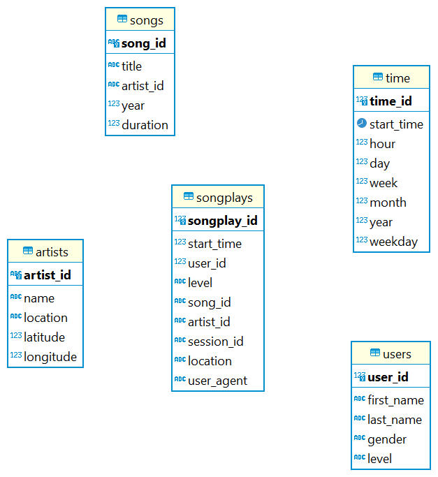

# Udacity Data Engineering - PostgreSQL Data Modelling
This is the solution for project PostgreSQL data modelling.
When run, this will read files from data folders, create database tables, and fetch the files content into respective tables.

## Project Intro
Quoted from _Udacity Data Engineering Course, section Data Modelling With Postgres (Project)_

## Introduction
A startup called Sparkify wants to analyze the data they've been collecting on songs and user activity on their new music streaming app. The analytics team is particularly interested in understanding what songs users are listening to. Currently, they don't have an easy way to query their data, which resides in a directory of JSON logs on user activity on the app, as well as a directory with JSON metadata on the songs in their app.  
They'd like a data engineer to create a Postgres database with tables designed to optimize queries on song play analysis, and bring you on the project. Your role is to create a database schema and ETL pipeline for this analysis. You'll be able to test your database and ETL pipeline by running queries given to you by the analytics team from Sparkify and compare your results with their expected results.

### Project Description
In this project, you'll apply what you've learned on data modeling with Postgres and build an ETL pipeline using Python. To complete the project, you will need to define fact and dimension tables for a star schema for a particular analytic focus, and write an ETL pipeline that transfers data from files in two local directories into these tables in Postgres using Python and SQL.

## Database
The database used for solution above is called `sparkifydb`, which consists of several tables:
  - `songplays` is the fact table for solving case above (what songs users are listening to)
  - `songs` is dimension table that act as songs master data
  - `time` is dimension table that act as when the user start listening
  - `users` is dimension table that act as users master data
  - `artist` is dimension table that act as song's artist / singer master data

 ## Table Diagram
 Columns for each table available below.
  

# Scripts
The main scripts are python 3 files:

  - `sql_queries.py` : contains all of the sql statements used to create database structure, and inserting / updating data
  - `create_tables.py` : contains steps to create database schema, which the DDL will refers to `sql_queries.py`
  - `etl.py` : read data on `data` folders (and subfolders), fetch the json files in it, transform the data into matching structure and columns, and insert data into database. This is dependent to `sql_queries.py` and `create_tables.py`
    
The .ipynb files is just for trial-error, not critical file.
  
## Run the scripts
From terminal

```
  #> python create_tables.py
  #> python etl.py
```