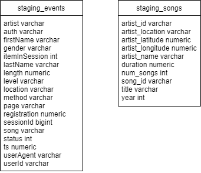
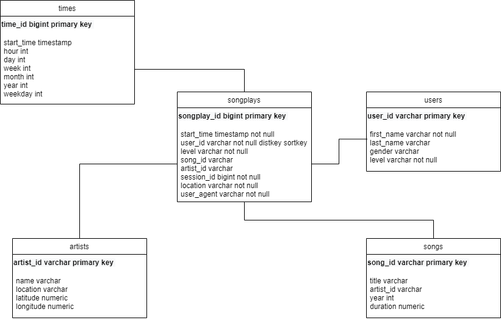

# About
This is a project for udacity data engineering nanodegree, for data warehouse lesson.
In this project, we works for music streaming startup, Sparkify, which has grown their user base and song database and want to move their processes and data onto the cloud. 
Sparkify original data resides in S3, in a directory of JSON logs on user activity on the app, as well as a directory with JSON metadata on the songs in sparkify app.
  
This project is a datawarehouse create-and-etl process, which will extract data from S3, stage into Redshift and transform the data into a set of fact-dimensional tables suitable for OLAP.

# Database Design
The project will have two staging tables, and five final tables.  
The staging tables are `staging_events` and `staging_songs`, both wll take data from JSON on S3.
The table structure for staging resemle json data, with no primary key or other constraints on staging tables.

 

 

# Python Files
There are several files for the project:
  - `sql_queries.py` contains all SQL statements (create tables, inserting data)
  - `create_tables.py` is executable to drop and re-create tables
  - `etl.py` is executable to fetch data from S3 into staging table, then into analytic tables

# Run The App
To run the application, run these files in sequence:
  1. `create_tables.py`
  2. `etl.py`